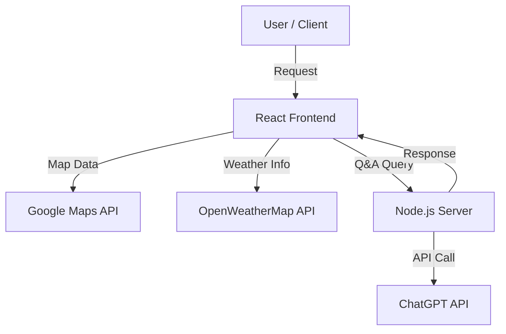

# 🏫 캠퍼스 생활 가이드 (Campus Life Guide)


> **"캠퍼스의 모든 정보를 한눈에."**
> <br/>Google Maps, OpenWeather, ChatGPT API를 연동하여 교내 시설 위치, 실시간 날씨, 학사 정보를 제공하는 반응형 웹 서비스

<br/>

## 📸 프로젝트 시연 (Demo)


<br/>

## 🛠 시스템 구조 (Architecture)


<br/>

## 📌 주요 기능 (Key Features)

* **🗺️ 인터랙티브 캠퍼스 맵 (Interactive Map)**
    * **Google Maps API**를 활용하여 캠퍼스 내 주요 건물(A/B/C 구역)과 주변 편의시설(식당, 카페 등)을 마커로 시각화
    * 카테고리별(한식, 중식, 카페) 필터링 및 마커 클릭 시 상세 정보(리뷰, 사진) 제공
* **⛅ 실시간 날씨 정보 (Live Weather)**
    * **OpenWeatherMap API**를 통해 현재 캠퍼스 위치의 기온, 날씨 상태, 풍속 정보를 팝업으로 실시간 제공
* **🤖 AI 챗봇 상담 (AI Assistant)**
    * **ChatGPT API**를 연동하여 학교생활 관련 질문에 대해 AI가 실시간으로 답변하는 Q&A 모달 구현
* **🔍 스마트 검색 & 하이라이팅 (Search & Highlight)**
    * 페이지 내 정보를 검색하면 해당 텍스트를 찾아 자동으로 스크롤 이동 및 **노란색 하이라이팅(Highlight)** 처리

 <br/>

## ⚡ 기술적 도전 및 해결 (Troubleshooting)

### 1. 검색어 하이라이팅 알고리즘 (Recursive DOM Search)
* [cite_start]**Issue:** 단순 `innerHTML` 치환 방식은 HTML 태그 내부의 속성값까지 변경하거나 이벤트 리스너를 끊어버릴 위험이 있어, 텍스트 노드만 정확히 타겟팅해야 함 [cite: 879, 880]
* [cite_start]**Solution:** DOM 트리를 재귀적으로 순회하며 `nodeType === 3` (Text Node)인 경우에만 검색어 일치 여부를 판단하고 스타일을 적용하는 로직 구현 [cite: 879]

```javascript
// 재귀적 텍스트 탐색 및 하이라이팅 함수
function highlightText(node, searchInput) {
    if (node.nodeType === Node.TEXT_NODE) { 
        const value = node.nodeValue.toLowerCase();
        const index = value.indexOf(searchInput);
        if (index !== -1) {
            const span = document.createElement("span");
            span.className = "highlight"; // CSS 클래스 적용
            span.textContent = node.nodeValue.substring(index, index + searchInput.length);
            // ... (기존 노드를 교체하는 로직)
        }
    } else if (node.nodeType === Node.ELEMENT_NODE) {
        // 자식 노드에 대해 재귀 호출
        node.childNodes.forEach(child => highlightText(child, searchInput)); 
    }
}
```

### 2. API 보안 및 환경 변수 관리
* **Issue:** 클라이언트 코드에 ChatGPT API Key가 노출될 경우 보안 위험 발생
* **Solution:** Backend(Node.js)를 구축하여 API 호출을 위임하고, `dotenv` 라이브러리를 사용해 API Key를 `.env` 파일로 분리하여 관리

```env
# .env 설정 예시
REACT_APP_GOOGLE_MAPS_KEY=your_google_key
OPENAI_API_KEY=your_openai_key
```
<br/>

## ⚙️ 기술 스택 (Tech Stack)

| Category | Technology |
|---|---|
| **Frontend** | React.js, HTML5, CSS3, JavaScript (ES6+), Bootstrap |
| **Backend** | Node.js, Express |
| **APIs** | Google Maps API, OpenWeatherMap API, ChatGPT API |
| **Tools** | Git, VS Code, Postman |
